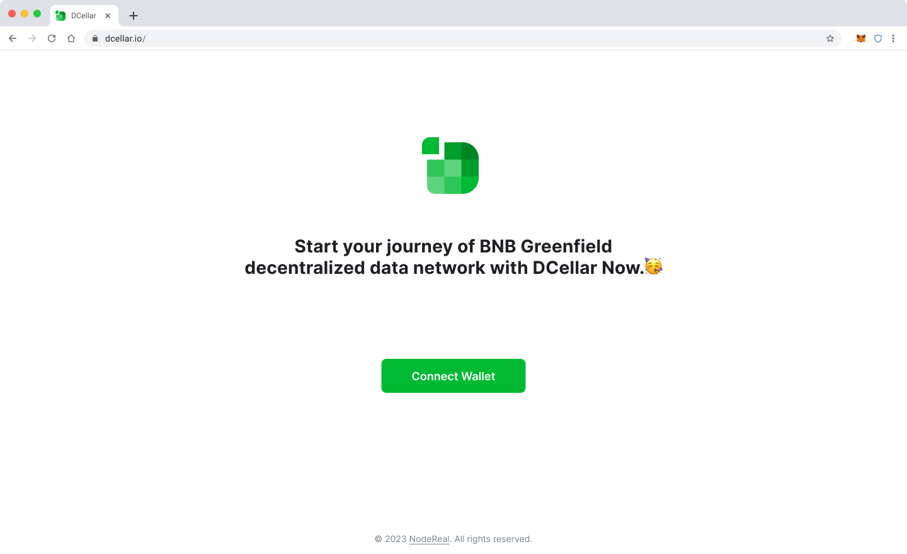
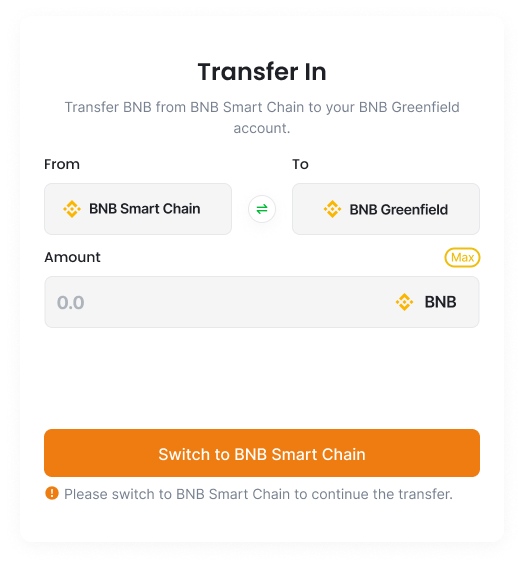
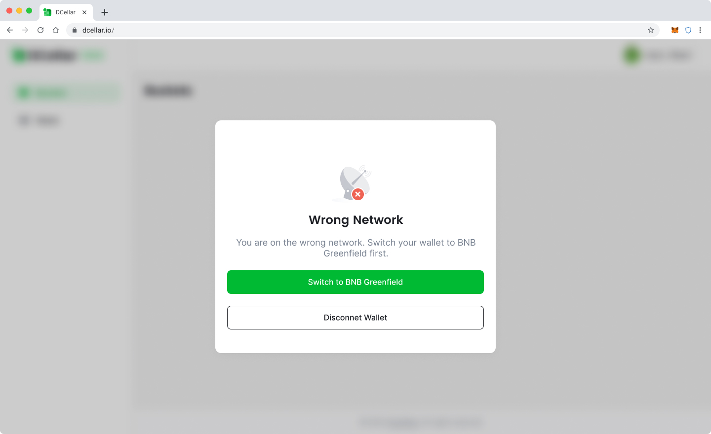
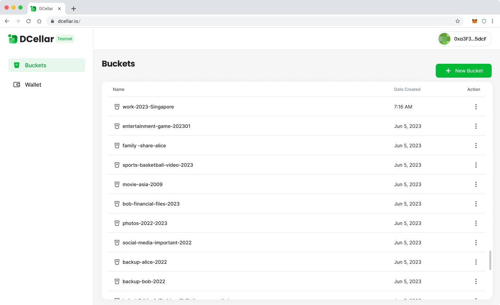
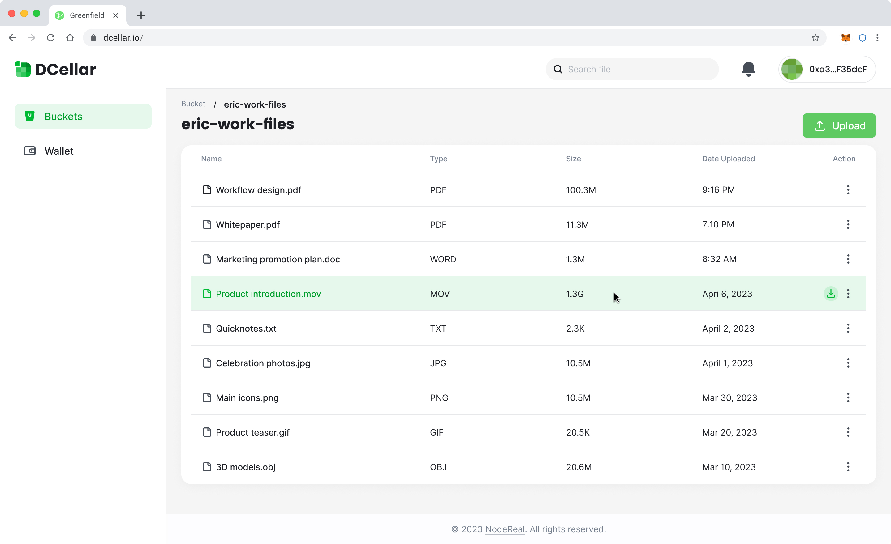
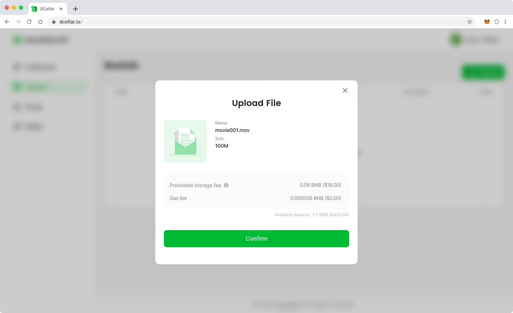
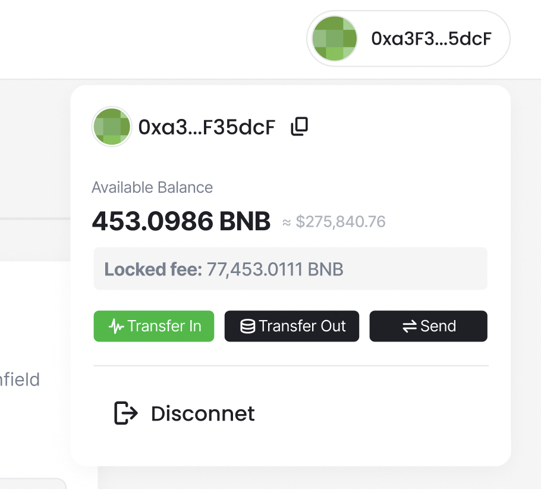
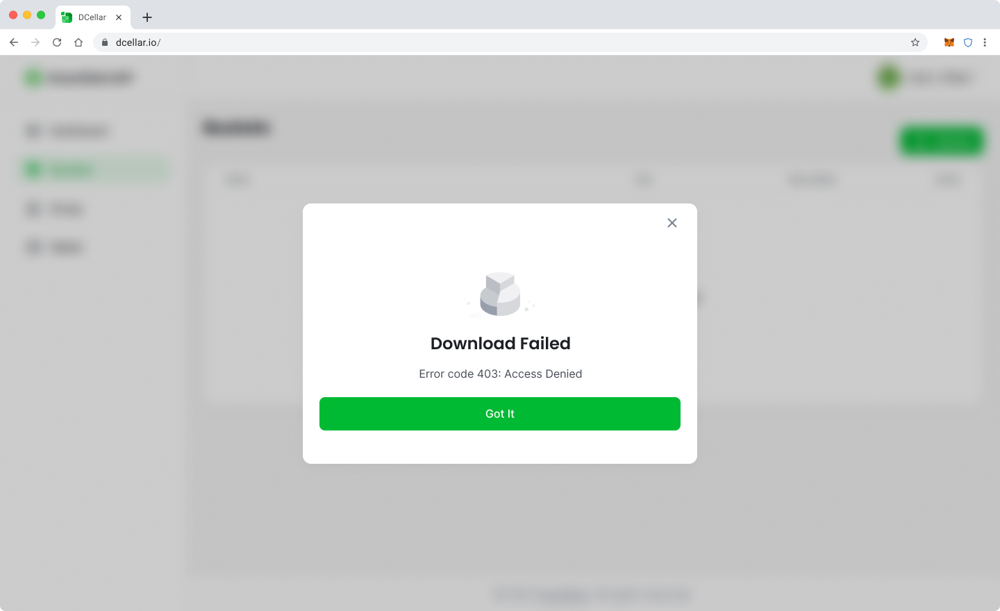
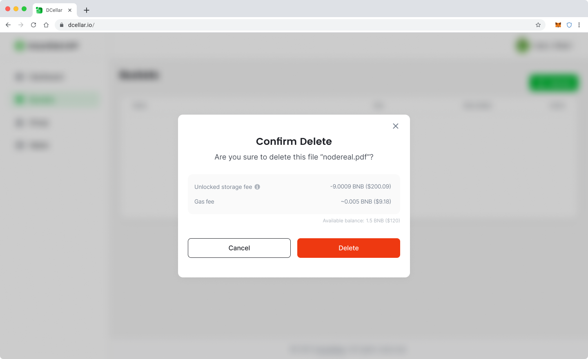
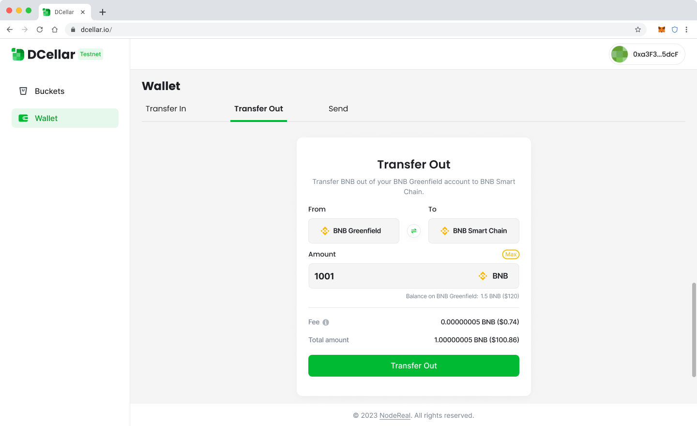

# DCellar

DCellar is the ultimate tool enabling user to start their decentralized data management journey on Greenfield. With DCellar  V1.0, You can store, download and delete your files, mange your account assets, while more functions are under planing. It is currently avaible as a WebUI, you can easily login with Metamask Wallet. This document helps you get started with DCellar.

::: warning
**Before using DCellar, please make sure you have already installed MetaMask browser extension on your web browser and you have already created your Metamask account. **
:::

## Login

For first time users, open your browser, and enter [decellar.io](http://dcellar.io), you will be able to see the Welcome Screen:

Click **Connect Wallet**, your Metamask wallet extension will be automatically avoked, and you will be login in with your current Metamask account.

<i>Login</i>

For first time users, you will need to add Greenfield Testnet to your Metamask Wallet, and you will be asked to switch your network to Greenfield Testnet to start following operations. 

::: Tips
If you are not able to add Greenfield Testnet automatically, you can try [Add Network to Metamask Manually](https://support.metamask.io/hc/en-us/articles/360043227612-How-to-add-a-custom-network-RPC). You can find Greenfield Testnet RPC info at [BNBChain List](https://www.bnbchainlist.org/). 

:::

::: Info

Greenfield Blockchain is fully EVM compatible, it has the same address format with other EVM compatible chains. After you successfully login, your Greenfield Testnet's Owner account is automatically created, and it shares the same account address with your Greenfield BSC Testnet account. 

:::

For Returning users, you will stay login in for a default time period. During the default time period, you will stay login when you come back. After that, you will need to login with Metamask Again. 

If you want to switch to your other metamask accounts, you can try **Disconnect** first, and then login again with another account. 

## Transfer In

Before start using Dcellar to store your files, you need to transfer in serveral amounts of BNB tokens from your *Greenfild BSC Testnet* Account to your *Greenfield Testnet* account, these two account share the same account address. 

::: Info

To claim test BNB token on *Greenfield BSC Testnet*, you can use our [**Faucet**](https://faucet-greenfield-testnet.nodereal.io/).

:::

After you login, you can see the Transfer In Tab under Wallet Page. Before you Transfer In, you shoud make sure you are currently under *Greenfild BSC Testnet*. If you are under *Greenfield Testnet*, your Transfer In page will be shown as follows:

<i>Switch to BNB Smart Chain</i>

Click **Switch to BNB Smart Chain**, your Metamask will be avoked, informing  you to switch network, by clicking **Switch Network** button on Metamask pop-up, you will be able to switch to *Greenfild BSC Testnet*. If you havn't add *Greenfild BSC Testnet* yet, Metamask will ask you to add network first, then switch to this network.

You will be able to Transfer in certain amount of BNB token from your *Greenfild BSC Testnet* account to your  *Greenfild Testnet* account which shares the same address. Transfer In will cost you two kinds of fees, all charged by BNB token:

- **Gas fee**: covers the gas cost for sending your transfer on the destination chain.
- **Relayer fee**: paid to relayers for handling cross-chain packets. 

Input the amount you want to Transfer In, Click **Transfer In**, your trasaction will be send. You can view your transaction details in [Greenfield BSC Testnet](https://greenfield-bsc-testnet-explorer.nodereal.io/).

## Create Bucket

Before you start using DCellar to manage your files, you shoud make sure you are currently under *Greenfild Testnet*. If you are under other network, you will be asked to Switch to BNB Greenfield first.

<i>Switch to BNB Greenfield</i>

A bucket is a logical container for storing objects in Greenfield. Once a bucket has been created, you can upload your files to a certain bucket.

After Login, you can see  **New Bucket** button at your bucket list page. 

<i>Bucket List</i>

After click **New Bucket**, a pop-up will show and you will be asked to enter a bucket name. Each bucket has a unique name that is assigned by the user when the bucket is created. Please follow the naming rules, carefully select your bucket name:

- Bucket names must be between 3 (min) and 63 (max) characters long.
- Bucket names can consist only of lowercase letters, numbers, dots (.), and hyphens (-).
- Bucket names must begin and end with a letter or number.
- Bucket names must not contain two adjacent periods.
- Bucket names must not be formatted as an IP address (for example, 192.168.5.4).
- Bucket names must be global unique in Greenfield
- A bucket name cannot be used by another Greenfield account until the bucket is deleted. 

<i>Create Bucket</i>

When you are creating a bucket, gas fee will be charged from your current login account, which is also your owner account. If your balance is insufficient, you will be informed to Transfer In first.

Since the owner's account will be the default payment account, in DCellar V1.0, your owner account will be used to pay for all your opreations. For more information about Owner Account and Payment Account, Please Go to [Billing and Payment](../concept/billing-payment.md).

:::Info

Every user account can create several buckets. The account will become the "owner" of the bucket.

:::

## Upload File 

Choose one bucket on your bucket list page, you can see the files within this bucket. Click **Upload File** , you will be able to choose a locally storaged file.

<i>File List</i>

::: Tips

Please notice that you can only choose one file at a time, and the file size should be no bigger than 2GB.

:::

When you are uploading a file, gas fee will be charged from your current login account, which is also your owner account.

Besides, once your file is uploaded successfully, you will be charging storage fee under a certain flow rate. Learn more about [flow rate](../greenfield-blockchain/modules/billing-and-payment.md). 

Therefore, when you are uploading a file, you need to make sure that your owner account has enough balance to cover the storage fee for the following six months. which will be shown as Prelocked storage fee as follow. 

<i>Upload File</i>

::: Info

Please notice that prelocked fee is not charged at the beganing, it still in your owner account. But you are not allowd to use it for other purpose because it's "locked". 

:::

You can view your total "locked fee" at your account page by clicking your account button on the top right corner.

<i>Locked Fee</i>

## Download File 

 

When you are downloading a file, gas fee will be charged from your current login account, which is also your owner account. If your balance is insufficient, you will be informed to Transfer In first.

::: Warning

Each download operation will consume **Download Quota**, which is related to file size. In current testing phase, each user will be given **5G**'s free quota. And users are not able to buy new quota.

:::

When your remaining quota is smaller than the required quota for a certain file you are downloading, your download will be failed, you will receive an error message as follow:

<i>Download Fail</i>

## Delete File

When you are deleting a file, gas fee will be charged from your current login account, which is also your owner account. If your balance is insufficient, you will be informed to Transfer In first.

Besides, when your file is deleted, your flow rate will be recalculated, part of your storage fee will be "unlocked". So you can see your "Unlocked storage fee" as follow when deleting file. 

<i>Delete File</i>

## Delete Bucket

You can delete the bucket created by you. Please notice you are only allowed to delete an empty bucket, which means you need to delete all your files in the bucket before you delete the bucket. 

When you are deleting a bucket, gas fee will be charged from your current login account, which is also your owner account.

## Send

With DCellar V1.0, you can send BNB token from your Greenfield owner account  to other Greenfield owner account. 

Before you send token to others, you shoud make sure you are currently under *Greenfild  Testnet*. If you are under *Greenfield BSC Testnet*, your Send page will be shown as follows:

<i>Switch to BNB Greenfield</i>

Click **Switch to BNB Greenfield**, your Metamask will be avoked, informing  you to switch network, by clicking **Switch Network** button on Metamask pop-up, you will be able to switch to *Greenfild Testnet*. 

::: Warning

Before Sending, please make sure the address you enter is a valid Greenfield Testnet account address. 

:::

Enter receiver's address and the amount you want the send, click **Send**, your transaction will be sent to Greenfield Testnet, and you will need to pay the gas fee on Greenfield Testnet.

<i>Send

## Transfer Out

With DCellar V1.0, you can transfer out BNB token from your Greenfield Testnet account  to your Greenfield BSC Testnet account which shares the same address. 

Before you Transfer Out, you shoud make sure you are currently under *Greenfild  Testnet*. If you are under *Greenfield BSC Testnet*, your Transfer Out page will be shown as follows:

<i>Switch to BNB Greenfield</i>

Click **Switch to BNB Greenfield**, your Metamask will be avoked, informing  you to switch network, by clicking **Switch Network** button on Metamask pop-up, you will be able to switch to *Greenfild Testnet*. 

Transfer Out will cost you two kinds of fees, all charged by BNB token:

- **Gas fee**: covers the gas cost for sending your transfer on the destination chain.
- **Relayer fee**: paid to relayers for handling cross-chain packets. 

Input the amount you want to Transfer Out, Click **Transfer Out, your trasaction will be send. You can view your transaction details in [Greenfield BSC Testnet Explorer](https://greenfield-bsc-testnet-explorer.nodereal.io/).

<i>Transfer Out</i>

