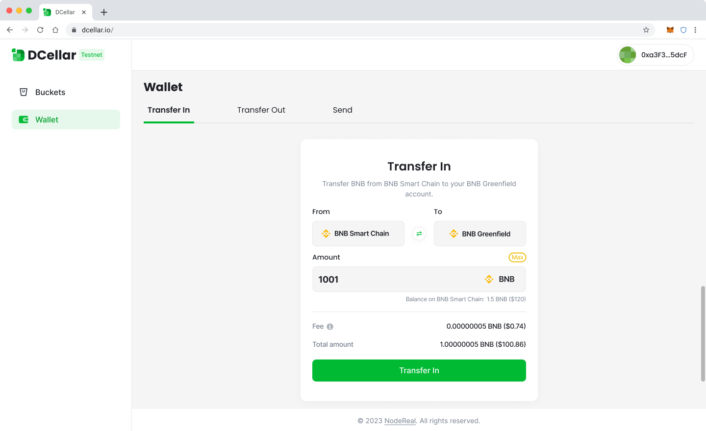

# Bridge

Before start using Greenfield, you need to transfer in serveral amounts of BNB tokens from your *Greenfild BSC Testnet* Account to your *Greenfield Testnet* account, these two account share the same account address. 

::: Info

To claim test BNB token on *Greenfield BSC Testnet*, you can use our [**Faucet**](https://faucet-greenfield-testnet.nodereal.io/).

:::

Greenfield provides multiple tools such as CLI, SDKs and DCellar to help you bridge your assets. This document mainly describe how to use DCellar to bridge your assets.

## Introduction 

DCellar is the ultimate tool enabling user to start their decentralized data management journey on Greenfield. With DCellar  V1.0, You can transfer in serveral amounts of BNB tokens from your *Greenfild BSC Testnet* Account to your *Greenfield Testnet* account, as well as send BNB token from one Greenfield owner account to another Greenfield owner account. 

::: warning
**Before using DCellar, please make sure you have already installed MetaMask browser extension on your web browser and you have already created your Metamask account. **
:::

## Login

For first time users, open your browser, and enter [decellar.io](http://dcellar.io), you will be able to see the Welcome Screen:

Click **Connect Wallet**, your Metamask wallet extension will be automatically avoked, and you will be login in with your current Metamask account.

<i>Login</i>

For first time users, you will need to add Greenfield Testnet to your Metamask Wallet, and you will be asked to switch your network to Greenfield Testnet to start following operations. 

::: Tips
If you are not able to add Greenfield Testnet automatically, you can try [Add Network to Metamask Manually](https://support.metamask.io/hc/en-us/articles/360043227612-How-to-add-a-custom-network-RPC). You can find Greenfield Testnet RPC info at [BNBChain List](https://www.bnbchainlist.org/). 

:::

::: Info

Greenfield Blockchain is fully EVM compatible, it has the same address format with other EVM compatible chains. After you successfully login, your Greenfield Testnet's Owner account is automatically created, and it shares the same account address with your Greenfield BSC Testnet account. 

:::

For Returning users, you will stay login in for a default time period. During the default time period, you will stay login when you come back. After that, you will need to login with Metamask Again. 

If you want to switch to your other metamask accounts, you can try **Disconnect** first, and then login again with another account. 

## Transfer In

Before start using Dcellar to store your files, you need to transfer in serveral amounts of BNB tokens from your *Greenfild BSC Testnet* Account to your *Greenfield Testnet* account, these two account share the same account address. 

After you login, you can see the Transfer In Tab under Wallet Page. Before you Transfer In, you shoud make sure you are currently under *Greenfild BSC Testnet*. If you are under *Greenfield Testnet*, your Transfer In page will be shown as follows:

<i>Switch to BNB Smart Chain</i>

Click **Switch to BNB Smart Chain**, your Metamask will be avoked, informing  you to switch network, by clicking **Switch Network** button on Metamask pop-up, you will be able to switch to *Greenfild BSC Testnet*. If you havn't add *Greenfild BSC Testnet* yet, Metamask will ask you to add network first, then switch to this network.

You will be able to Transfer in certain amount of BNB token from your *Greenfild BSC Testnet* account to your  *Greenfild Testnet* account which shares the same address. Transfer In will cost you two kinds of fees, all charged by BNB token:

- **Gas fee**: covers the gas cost for sending your transfer on the destination chain.
- **Relayer fee**: paid to relayers for handling cross-chain packets. 

Input the amount you want to Transfer In, Click **Transfer In**, your trasaction will be send. You can view your transaction details in [Greenfield BSC Testnet Explorer](https://greenfield-bsc-testnet-explorer.nodereal.io/).

<i>Transfer In</i>

## Transfer Out

With DCellar V1.0, you can transfer out BNB token from your Greenfield Testnet account  to your Greenfield BSC Testnet account which shares the same address. 

Before you Transfer Out, you shoud make sure you are currently under *Greenfild  Testnet*. If you are under *Greenfield BSC Testnet*, your Transfer Out page will be shown as follows:

<i>Switch to BNB Greenfield</i>

Click **Switch to BNB Greenfield**, your Metamask will be avoked, informing  you to switch network, by clicking **Switch Network** button on Metamask pop-up, you will be able to switch to *Greenfild Testnet*. 

Transfer Out will cost you two kinds of fees, all charged by BNB token:

- **Gas fee**: covers the gas cost for sending your transfer on the destination chain.
- **Relayer fee**: paid to relayers for handling cross-chain packets. 

Input the amount you want to Transfer Out, Click **Transfer Out, your trasaction will be send. You can view your transaction details in [Greenfield BSC Testnet Explorer](https://greenfield-bsc-testnet-explorer.nodereal.io/).

<i>Transfer Out</i>
